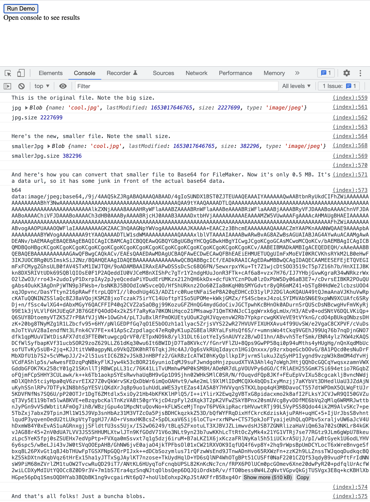

# Create a small jpg starting from a big jpg base64 string

## install

```bash
npm i
```

## run

```bash
npm start
```

Open localhost:1234. Click the `Run Demo` button and look in the console.


